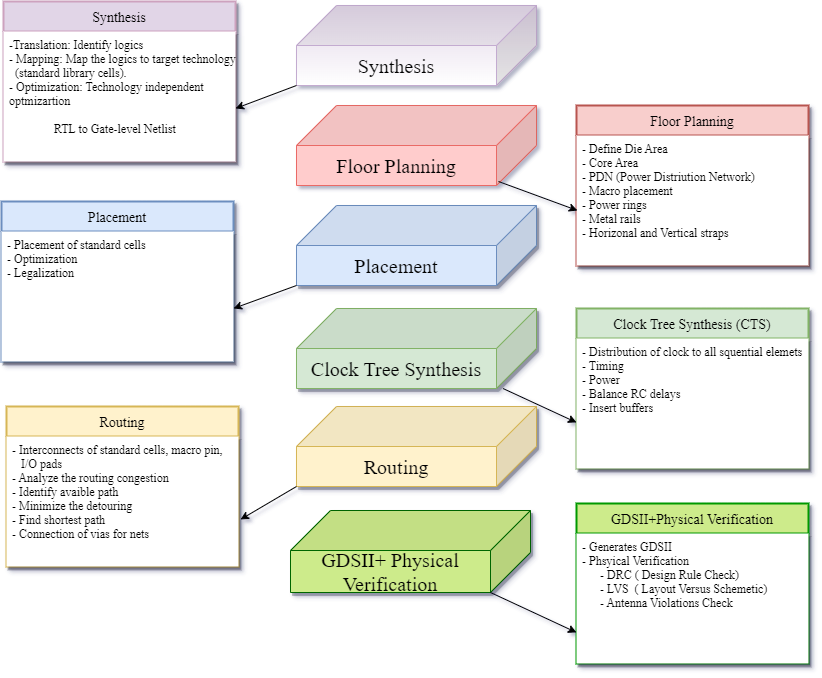
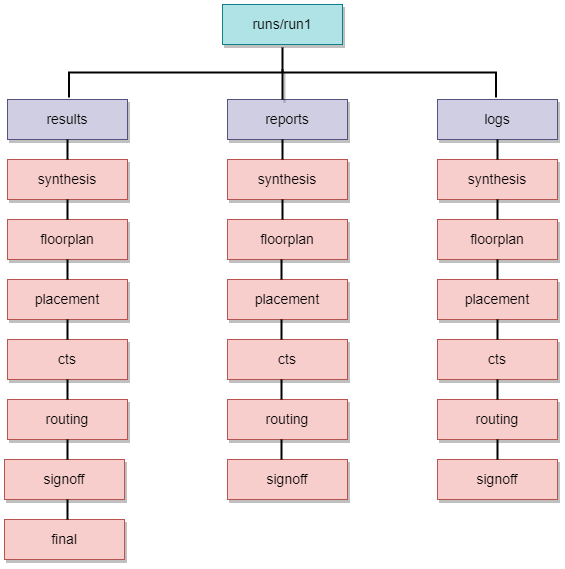
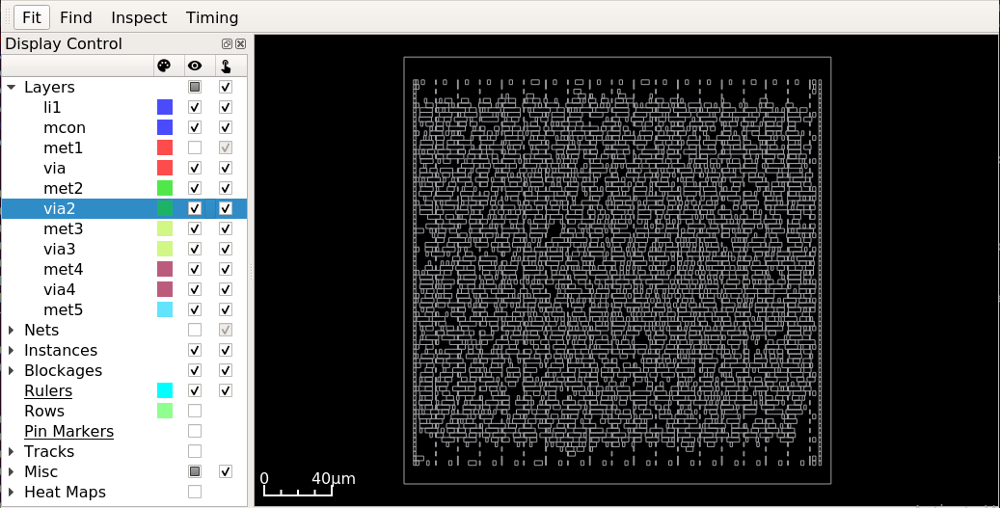

=============
Flow Tutorial
=============

Introduction
============
This document includes tutorials for running an complete OpenROAD-based flow from RTL to GDSII. This tutorials include GUI visualization, Klayout visualization, EDA tools, design explorations, and different design experiments. Additionally, a brief description of each step in the flow is provided, facilitating the user’s comprehension and ease of use of the OpenROAD OpenLane tool.

Overview Of OpenLane Flow
--------------------------
The OpenRoad OpenLane is an automated RTL to GDSII flow built around an open source tool. The flow performs the auto place and route of an ASIC design -in 24 hours with no human in the loop.

Getting Started
----------------
This section assumes a Validation of OpenLane installation to execute RTL to GDSII flow of the design. This section describes the environment setup to run a design in both automatic and interactive mode.

``mem_1r1w`` is a memory design used to run the flow in the tutorial.

Setting Up Environment
-----------------------

Set the necessary platform and design configuration file in order to run a complete flow of design ``mem_1r1w``.

Platform Configuration
-----------------------

.. code-block:: shell

   (PDK) "sky130A"
   (STD_CELL_LIBRARY) "sky130_fd_sc_hd"

The libraries cell information can found `here <https://antmicro-skywater-pdk-docs.readthedocs.io/en/test-submodules-in-rtd/contents/libraries.html>`_.

Design Configuration
---------------------
Set the basic configuration config.tcl file for a design using the `OpenLane Variables <https://openlane-docs.readthedocs.io/en/rtd-develop/configuration/README.html>`_:

.. code-block:: shell

   set ::env(DESIGN_NAME) <the top-level design name>
   # Change if needed
   set ::env(VERILOG_FILES) <pointer the path of verilog source file >
   set ::env(CLOCK_PORT) <list of clock port in the design> #if your design doesn't have a clock then you can avoid setting set ::env(CLOCK_PORT).
   set ::env(DESIGN_IS_CORE) 1 #if you are designing a chip core or 0 for hardening a macro.

View the design configuration file of mem_1r1w:

.. code-block:: shell
   
   ./designs/mem_1r1w/config.tcl

.. important::
   
   It is mandatory to add a correct top-level design in the DESIGN_NAME and the correct path of verilog source file in VERILOG_FILES and platform in order to start the flow.

Design Source File
-------------------

The input verilog source file of mem_1r1w is:

.. code-block:: shell
   
   ./designs/mem_1r1w/src/mem_1r1w.v

Running The Automatic  RTL to GDS Flow
=======================================
This section describes the execution of automatic RTL to GDS flow from synthesis to final GDSII using the Tcl script without human interaction. This section also includes an interactive mode where users can run the individual stage flow using tool commands and understand each flow stage at their own pace and preference.

Learn the `interactive mode  <Interactive_Mode.html>`_ and run the design.

Design Goal
------------
Run the ``mem_1r1w`` design in an automatic flow using the above design configuration file for the given design goals to meet the timing and ensure it is clean from all DRC, LVS, and antenna violations.

- Area

.. code-block:: shell
   
   DIE_AREA {0 0 250 250} in microns

- Timing

The clock period time to meet the timing of the design:

.. code-block:: shell

   CLOCK_PERIOD “10.0” in ns

Running the automatic flow inside the docker with:

.. code-block:: shell
   
   ./flow.tcl -design mem_1r1w -tag run1

Run Directory Structure
-----------------------
As the flow is completed, it is important to check the results, reports, and logs file of each flow inside the run directory to understand and debug in case of flow failure:

.. code-block:: shell
   
   ./design/mem_1r1w/runs/run1

- View the reports directory of ``mem_1r1w`` which contains area, timing, DRC, and antenna reports:

.. code-block:: shell

   ./designs/mem_1r1w/runs/run1/reports/

- View the logs of ``mem_1r1w`` for every step in the each stage of flow:

.. code-block:: shell

   ./designs/mem_1r1w/runs/run1/logs/

View Results Of The Flow
-------------------------

- View the results directory of ``mem_1r1w`` flow of each stage which contains ``.v/``, ``.def/``, ``.sdc/``, ``sdf/``, ``spef/``, ``.lef/``, ``.gds/`` file:

.. code-block:: shell

   ./designs/mem_1r1w/runs/run1/results/

Flow stages
===========
Users can view flow results using the command interface from the shell or OpenROAD GUI to visualize the layout or results and debug it.

Refer to the `OpenROAD GUI <https://openroad.readthedocs.io/en/latest/main/src/gui/README.html>`_ to learn how to open GUI, visualizes and debug.

Synthesis
----------
- View the results of the synthesis, a generated netlist ``.v/`` file of ``mem_1r1w``:

.. code-block:: shell
   
   ./designs/mem_1r1w/runs/run1/results/synthesis/mem_1r1w.v

**Area**

View the resulting area and its core utilization of ``mem_1r1w``:

.. code-block:: shell
   
   Design area 25379 u^2 100% utilization

**Timing**

View the worst slack, worst negative slack and total negative slack from the reports:

.. code-block:: shell
   
   report_worst_slack -max (Setup)
   worst slack 5.79
   report_worst_slack -min (hold)
   worst slack 0.29
   wns 0.00
   tns 0.00 

Explore different synthesis strategies for timing and area optimization:

.. code-block:: shell

   set ::env(SYNTH_STRATEGY) "DELAY 0", 1, 2 # for timing optimization
   set ::env(SYNTH_STRATEGY) "AREA 1", 1, 2 # for area optimization

set the above variable in the ``config.tcl`` file and re-run the design to see the impact.

Floor Planning
--------------

- View the results of the floorplan ``.def/`` file of ``mem_1r1w``:

.. code-block:: shell

   ./designs/mem_1r1w/runs/run1/results/floorplan/mem_1r1w.def

View the initialization of floorplan based on ``DIE_AREA {0 0 250 250}`` on gui:

.. image:: ../_static/initial.png

View the placement of I/O pins:

.. image:: ../_static/io.png

View the power planning ``pdn``:

.. image:: ../_static/pdn(2).png

Placement
----------
- View the results of placement ``.def/``, ``.v/`` file on gui:

.. code-block:: shell

   ./designs/mem_1r1w/runs/run1/results/placement/mem_1r1w.def

Change the ``DIE_AREA`` or ``FP_CORE_UTIL`` and ``PL_TARGET_DENSITY`` in the ``config.tcl`` and re-run the design to see the impact on the placement of standard cells.

Clock Tree Synthesis
--------------------

- View the results directory of cts of ``mem_1r1w``:

.. code-block:: shell

   ./designs/mem_1r1w/runs/run1/results/cts/mem_1r1w.def

View resulting clock tree synthesis and inserted clock buffers on gui:

.. image:: ../_static/cts.png

Routing
--------
- View the results directory of routing of ``mem_1r1r``:

.. code-block:: shell

   ./designs/mem_1r1w/runs/run1/routing/mem_1r1w.def

View the resulting routing of ``mem_1r1w``:

.. image:: ../_static/routing(1).png

SignOff
--------
- View the final layout GDSII and check it is DRC, LVS and antenna check passed.

load the final GDSII using klayout:

.. code-block:: shell

   klayout mem_1r1r.gds

.. image:: ../_static/final.png

