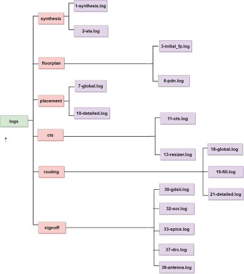
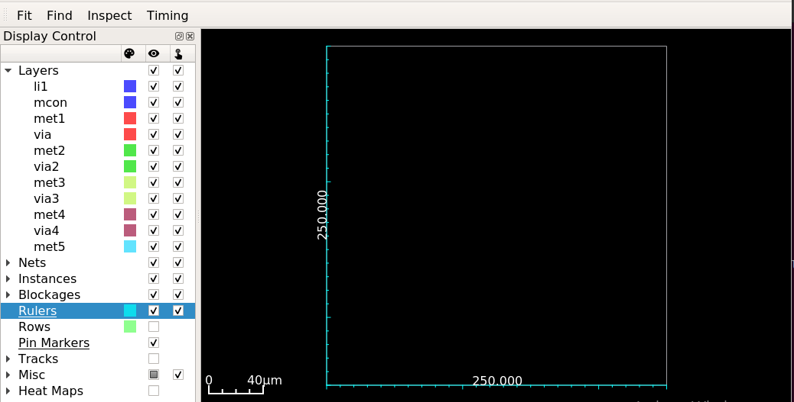
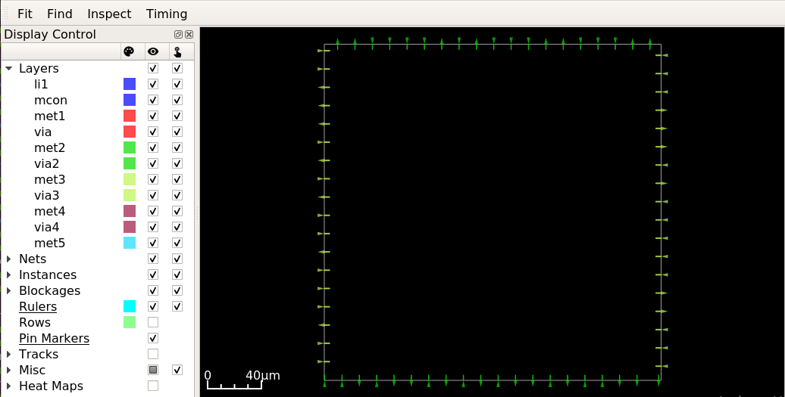
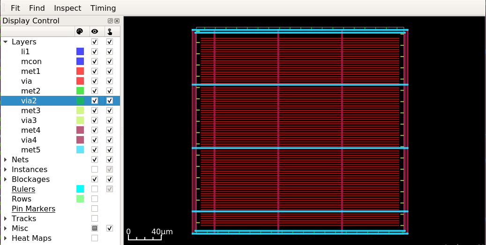
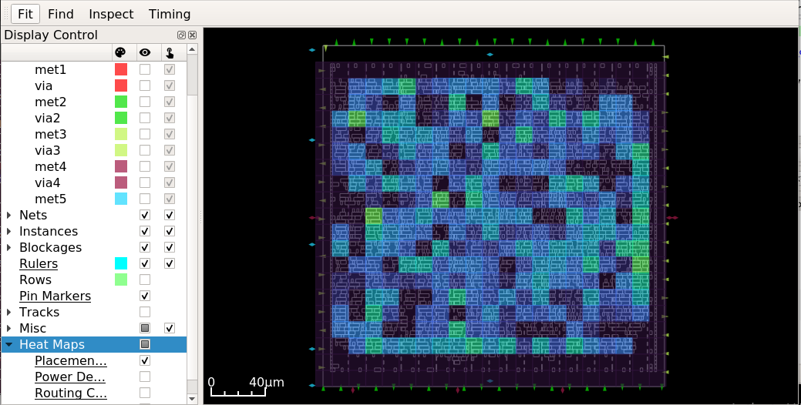
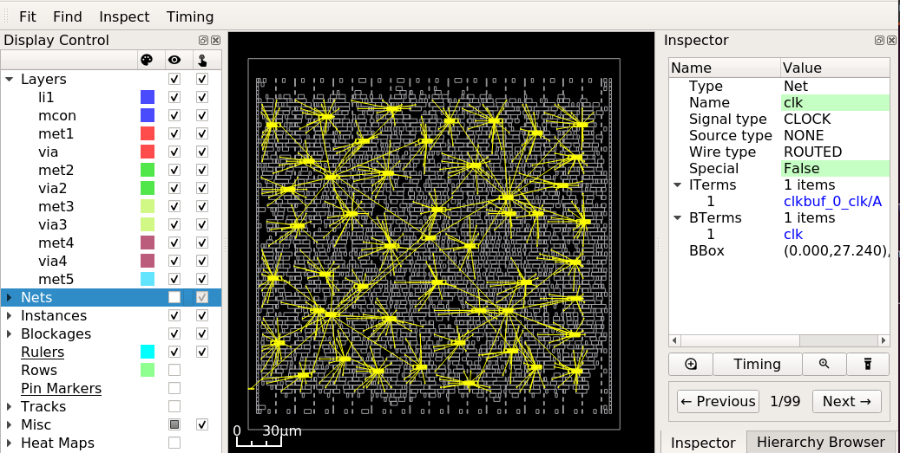
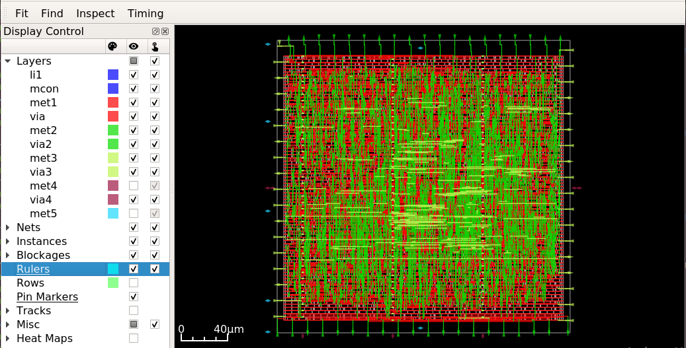
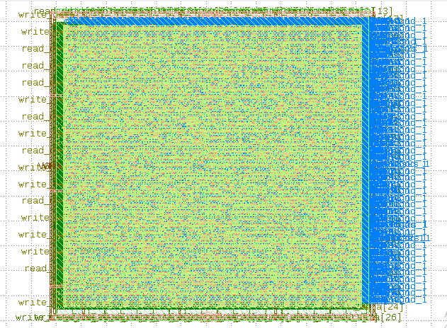

=============
Flow Tutorial
=============

Introduction
============
OpenLane is an automated RTL-GDSII flow based on several components including OpenROAD, Yosys, Magic, Netgen, CVC, Klayout and a number of custom scripts for design exploration and optimization. The flow performs full ASIC implementation steps from RTL all the way down to GDSII.

You will learn how to set up and run the OpenLane flow from RTL to GDSII and generate a DRC, LVS clean layout.

Getting Started
----------------

This section describes the environment setup to run a design in both automatic and interactive mode.

``mem_1r1w`` is a memory design used in the tutorial.

Setting Up Environment
-----------------------

Install the OpenLane. Refer to the OpenLane Installation.

Configuring The Design
-----------------------
This section describes how to set up the necessary platform and design configuration files to run the complete RTL-GDSII flow.

Refer to `Openlane Variables <https://github.com/The-OpenROAD-Project/OpenLane/blob/master/configuration/README.md>`_ for platform and design configuration variables.

Platform Configuration
-----------------------
The default variable for platform configuration of the design:

.. code-block:: shell

   set ::env(PDK) "sky130"
   set ::env(STD_CELL_LIBRARY) <path for sky130_fd_sc_hd> # set by default

Refer to the library information `here <https://antmicro-skywater-pdk-docs.readthedocs.io/en/test-submodules-in-rtd/contents/libraries.html>`_.

Design Configuration
---------------------
Set the basic configuration config.tcl file for a design using the `OpenLane Variables <https://github.com/The-OpenROAD-Project/OpenLane/blob/master/configuration/README.md>`_:

.. code-block:: shell

   set ::env(DESIGN_NAME) mem_1r1w
   set ::env(VERILOG_FILES) [glob $::env(DESIGN_DIR)/src/*.v]
   set ::env(SDC_FILE) "./designs/mem_1r1w/constraint.sdc"
   set ::env(CLOCK_PORT) "clk"
   set ::env(CLOCK_NET) $::env(CLOCK_PORT)
   
- View the design configuration file of ``mem_1r1w``:

.. code-block:: shell
   
   ./designs/mem_1r1w/config.tcl

Timing constraint
-------------------

- View the timing constraints specified in the ``.sdc`` file:

.. code-block:: shell

   ./designs/mem_1r1w/constraint.sdc
   
.. note::

   The timing constraints can be specified according to the design requirement. 

Design Source File
-------------------

- View the input verilog source file of ``mem_1r1w`` is:

.. code-block:: shell
   
   ./designs/mem_1r1w/src/mem_1r1w.v

Running The Automatic  RTL-GDSII Flow
=======================================

In this section you will learn how to run the complete design flow from RTL-GDSII both in the interactive and automatic flow.

Refer to `README.md <https://github.com/The-OpenROAD-Project/OpenLane#command-line-arguments>`_ for command line argument usage of ``./flow.tcl``

Refer to `interactive mode <Interactive_Mode.html>`_ to learn how to run a complete design flow in interactive mode.

Design Goal
------------
Run the ``mem_1r1w`` design in an automatic flow using the above design configuration file for the given design goals to meet the timing and ensure it is clean from all DRC, LVS, and antenna violations.

- Timing

Use the clock period to meet the timing of the ``mem_1r1w``:

.. code-block:: shell

   CLOCK_PERIOD “10.0” #in ns
   
Make sure you are in the openlane directory:

.. code-block:: shell

   cd Openlane

Run the complete flow with:

.. code-block:: shell
   
   ./flow.tcl -design mem_1r1w -tag run1

Run Directory Structure
-----------------------

The flow is completed, check the results, reports, and logs files of each stage flow within the run directory:

.. code-block:: shell
   
   ./design/mem_1r1w/runs/run1

View logs OF The Flow
----------------------

The example log tree structure below shows the step number for each flow stage, indicating its position in the RTL-GDSII flow. In case of flow failure, you can use these logs to understand each stage and debug.

- View the logs files:

.. code-block:: shell

   ./designs/mem_1r1r/runs/run1/logs/

View Reports OF The Flow:
-------------------------

- View the reports of the flow which contains area, timing, DRC, and antenna reports:

.. code-block:: shell

   ./designs/mem_1r1w/runs/run1/reports/

- The table below shows the generated example reports:

+--------------------------------+-----------------------------+-----------------------+
|``1-synthesis.AREA_0.chk.rpt``  | ``1-synthesis_dff.stat``    |    ``2-syn_sta.rpt``  |
|                                |                             |                       |
+--------------------------------+-----------------------------+-----------------------+
| ``3-initial_fp_core_area.rpt`` |``3-initial_fp_die_area.rpt``|    11-cts_sta.rpt     |
|                                |                             |                       |
+--------------------------------+-----------------------------+-----------------------+
| ``11-cts_sta.clock_skew.rpt``  |     ``18-grt_sta.rpt``      |   ``32-xor.rpt``      |
|                                |                             |                       |
+--------------------------------+-----------------------------+-----------------------+
| ``38-antenna_violators.rpt``   |         ``drc.rpt``         |                       |
|                                |                             |                       |
+--------------------------------+-----------------------------+-----------------------+

View Result Of The Flow:
------------------------

- View the results of the flow which contains ``.def``, ``.v``, ``lef``, ``.sdf``, ``.spef``,  ``.spi``, ``.sdc`` and ``.gds`` files:

.. code-block:: shell

   ./designs/mem_1r1w/runs/run1/results/

   
Flow stages
===========

You can view flow results using the command interface from the shell or OpenROAD GUI to visualize the layout and debug it.

Refer to the `OpenROAD GUI <https://openroad.readthedocs.io/en/latest/main/src/gui/README.html>`_ to learn how to open GUI and visualize the design objects.

Synthesis
----------

- View the results of the synthesis, a generated netlist ``.v`` file of ``mem_1r1w``:

.. code-block:: shell
   
   ./designs/mem_1r1w/runs/run1/results/synthesis/mem_1r1w.v

Synthesis Exploration
-----------------------

- Explore different synthesis strategies for timing and area optimization:

.. code-block:: shell

  set ::env(SYNTH_STRATEGY) "DELAY 0", 1, 2 # for timing optimization
  set ::env(SYNTH_STRATEGY) "AREA 1", 1, 2 # for area optimization

set the above variable in the ``config.tcl`` file and re-run the design to see the impact.

FloorPlanning
--------------

- View the results of the floorplan ``.def`` file of ``mem_1r1w``:

.. code-block:: shell

   ./designs/mem_1r1w/runs/run1/results/floorplan/mem_1r1w.def

- View the initialization of floorplan based on ``DIE_AREA {0 0 250 250}`` on gui:

- View the placement of I/O pins:

- View the power planning ``pdn``:

Placement
----------

- View the results of the placement ``.def`` file:

.. code-block:: shell

   ./designs/mem_1r1w/runs/run1/results/placement/mem_1r1w.def

- View the placement density heatmap of ``mem_1r1w`` design on gui:

Change the ``DIE_AREA`` or ``FP_CORE_UTIL`` and ``PL_TARGET_DENSITY`` in the ``config.tcl`` and re-run the design to see the impact on the placement density of standard cells.

Clock Tree Synthesis
--------------------

- View the results of the cts of ``mem_1r1w``:

.. code-block:: shell

   ./designs/mem_1r1w/runs/run1/results/cts/mem_1r1w.def

- View resulting clock tree synthesis and inserted clock buffers on gui:

Routing
--------
- View the results of the routing of ``mem_1r1r``:

.. code-block:: shell

   ./designs/mem_1r1w/runs/run1/routing/mem_1r1w.def

- View the resulting routing of ``mem_1r1w``:

- Timing should meet after the routing stage, view the timing report of ``mem_1r1w``:

.. code-block:: shell

   ./designs/mem_1r1w/runs/run1/reports/routing/

- **Timing**

View the worst slack, worst negative slack and total negative slack of ``mem_1r1w``:

.. code-block:: shell
   
   report_worst_slack -max (Setup)
   worst slack 6.48
   report_worst_slack -min (Hold)
   worst slack 0.50
   wns 0.00
   tns 0.00

SignOff
--------
- View the final layout GDSII and check if it has passed DRC, LVS and antenna check

.. code-block:: shell

   ./designs/mem_1r1w/runs/run1/results/final/gds/mem_1r1w.gds

- Load the final GDSII layout using klayout :

.. code-block:: shell

   klayout mem_1r1r.gds

