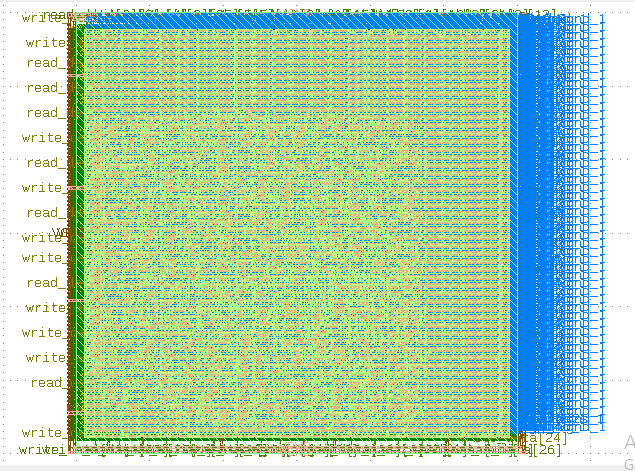

=============
Flow Tutorial
=============

Introduction
============

This document includes tutorials for running an entire OpenROAD-based
flow from RTL to GDSII.This tutorials includes GUI visualization, klayout visualization, EDA
tools, Design Explorations, and Different Design Experiments.
Additionally, a brief description of each step in the flow is provided,
facilitating the user’s comprehension and ease of usage.

Platform 
----------

.. code-block:: shell

   set ::env(PDK) "sky130A"
   set ::env(STD_CELL_LIBRARY) "sky130_fd_sc_hd"

The libraries cell information can found `here <https://antmicro-skywater-pdk-docs.readthedocs.io/en/test-submodules-in-rtd/contents/libraries.html>`_.

Design Configuration
--------------------

View the design configuration file of mem_1r1w:

.. code-block:: shell

  ./designs/mem_1r1w/config.tcl

View the design `configuration file <https://github.com/nimra471/OpenLane/tree/master/designs/mem_1r1w/config.tcl>`_.

.. important::

   The following design_specific Configuration are required to specify main design input such as platform, top-level design and timing constraints.
   The required variables for design configuration is `here <OpenLane_Variable.html>`_.

Design Input Verilog
--------------------

The input Verilog files are located at this path:

.. code-block:: shell

   ./designs/mem_1r1w/src/mem_1r1w.v

Running The Automatic RTL-to-GDS Flow
=======================================

This section describe the complete RTL-to-GDS flow of the design. In this tutorial, user will learn both automated and interactive way to run the flow way.

Design Goals
------------

- Area

.. code-block:: shell

   DIE_AREA { 0 0 300 300} in microns

- Timing

The clock period time to meet the timing of the design.

.. code-block:: shell
   
   CLOCK_PERIOD "10.0" in ns

Running the Design
------------------

.. code-block:: shell
   
   ./flow.tcl -design mem_1w1r -tag run_final

   
View Result of the flow
-----------------------

.. code-block:: shell

   ./design/mem_1r1w/runs/run_final/result/

The area, power and timing report is found in the report directory ``./design/mem_1r1w/runs/run_final/report/synthesis/``.

Area
-----

.. code-block:: shell
   
   ===========================================================================
   report_design_area
   ============================================================================
   Design area 25379 u^2 100% utilization.
   

Power                                              
--------

.. code-block:: shell
   
   ===========================================================================
   report_power
   ============================================================================
   Group                  Internal  Switching    Leakage      Total
                          Power      Power      Power      Power (Watts)
   ----------------------------------------------------------------
   Sequential             2.35e-03   8.74e-05   4.59e-09   2.44e-03  83.3%
   Combinational          3.38e-04   1.52e-04   4.51e-09   4.90e-04  16.7%
   Macro                  0.00e+00   0.00e+00   0.00e+00   0.00e+00   0.0%
   Pad                    0.00e+00   0.00e+00   0.00e+00   0.00e+00   0.0%
   ----------------------------------------------------------------
   Total                  2.69e-03   2.40e-04   9.10e-09   2.93e-03 100.0%
                          91.8%       8.2%       0.0%

Timing
-------

.. code-block:: shell
    
     5.79   slack (MET)
     tns 0.00
     wns 0.00

Viewing Layout Result 
----------------------

Load the GDS file on klayout from the result diractory ``./design/mem_1r1w/runs/run_final/result/final/gds`` using the command:

.. code-block:: shell

   klayout mem_1w1r.gds

GUI
=======
The OpenROAD GUI is a powerful visualization, analysis and debugging errors using TCL command interface.

Running GUI
------------

Launch OpenROAD GUI by running the command inside the OpenLane docker image:

.. code-block:: shell
   
   make mount
   openroad -gui

Synthesis Exploration
----------------------

Floor planning
----------------

Macro Placement
----------------

Placement
----------

Clock Tree Synthesis
---------------------

Routing
--------

DRC Check
----------

                                                                                                                                                                                                           

