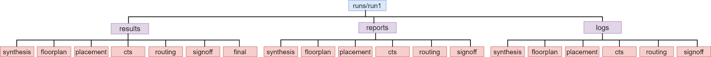

=============
Flow Tutorial
=============

Introduction
============
This document includes tutorials for running an complete OpenROAD-based flow from RTL to GDSII. This tutorials include GUI visualization, Klayout visualization, EDA tools, design explorations, and different design experiments. Additionally, a brief description of each step in the flow is provided, facilitating the user’s comprehension and ease of use of the OpenLane tool.

.. image:: ../_static/OpenLane_flow.png

Getting Started
----------------
This section describes the environment setup for OpenLane and how to get ready to execute the  RTL to GDSII flow.

``mem_1r1w`` is a memory design used in the tutorial.

Setting Up Environment
-----------------------
Install the OpenROADOpenLane. Refer to the OpenLane Installation.

Platform Configuration
-----------------------

.. code-block:: shell

Refer to the library information `here <https://antmicro-skywater-pdk-docs.readthedocs.io/en/test-submodules-in-rtd/contents/libraries.html>`_.

Design Configuration
---------------------
Set the basic configuration config.tcl file for a design using the `OpenLane Variables <https://openlane-docs.readthedocs.io/en/rtd-develop/configuration/README.html>`_:

.. code-block:: shell
   

View the design configuration file of ``mem_1r1w``:

.. code-block:: shell
   
   ./designs/mem_1r1w/config.tcl

.. important::
   
   It is mandatory to add a correct top-level design in the DESIGN_NAME and the correct path of verilog source file in VERILOG_FILES and platform in order to start the flow.

Design Source File
-------------------

The input verilog source file of ``mem_1r1w`` is:

.. code-block:: shell
   
   ./designs/mem_1r1w/src/mem_1r1w.v

Running The Automatic  RTL-GDSII Flow
=======================================
This section describes the execution of automatic RTL to GDS flow from synthesis to final GDSII using the Tcl script without human interaction. This section also includes an interactive mode where users can run the individual stage flow using tool commands and understand each flow stage at their own pace and preference.

Learn the `interactive mode  <Interactive_Mode.html>`_ and run the design.

Design Goal
------------
Run the ``mem_1r1w`` design in an automatic flow using the above design configuration file for the given design goals to meet the timing and ensure it is clean from all DRC, LVS, and antenna violations.

The clock period time to meet the timing of the design:

.. code-block:: shell

   CLOCK_PERIOD “10.0” in ns

Running the automatic flow inside the docker with:

.. code-block:: shell
   
   ./flow.tcl -design mem_1r1w -tag run1

Run Directory Structure
-----------------------
As the flow is completed, it is important to check the results, reports, and logs file of each flow inside the run directory to understand and debug in case of flow failure:

.. code-block:: shell
   
   ./design/mem_1r1w/runs/run1

- View the reports directory of ``mem_1r1w`` which contains area, timing, DRC, and antenna reports:

.. code-block:: shell

   ./designs/mem_1r1w/runs/run1/reports/

- View the logs of ``mem_1r1w`` for every step in the each stage of flow:

.. code-block:: shell

   ./designs/mem_1r1w/runs/run1/logs/

View Results Of The Flow
-------------------------

- View the results directory of ``mem_1r1w`` flow of each stage which contains ``.v``, ``.def``, ``.sdc``, ``sdf``, ``spef``, ``.lef``, ``.gds`` file:

.. code-block:: shell

   ./designs/mem_1r1w/runs/run1/results/

Flow stages
===========
Users can view flow results using the command interface from the shell or OpenROAD GUI to visualize the layout or results and debug it.

Refer to the `OpenROAD GUI <https://openroad.readthedocs.io/en/latest/main/src/gui/README.html>`_ to learn how to open GUI, visualizes and debug.

Synthesis
----------
- View the results of the synthesis, a generated netlist ``.v`` file of ``mem_1r1w``:

.. code-block:: shell
   
   ./designs/mem_1r1w/runs/run1/results/synthesis/mem_1r1w.v

- Explore different synthesis strategies for timing and area optimization:

.. code-block:: shell

   set ::env(SYNTH_STRATEGY) "DELAY 0", 1, 2 # for timing optimization
   set ::env(SYNTH_STRATEGY) "AREA 1", 1, 2 # for area optimization

set the above variable in the ``config.tcl`` file and re-run the design to see the impact.

Floor Planning
--------------

- View the results of the floorplan ``.def`` file of ``mem_1r1w``:

.. code-block:: shell

   ./designs/mem_1r1w/runs/run1/results/floorplan/mem_1r1w.def

- View the initialization of floorplan based on ``DIE_AREA {0 0 250 250}`` on gui:

.. image:: ../_static/initial.png

- View the placement of I/O pins:

.. image:: ../_static/io.png

- View the power planning ``pdn``:

.. image:: ../_static/pdn(2).png

- View the reports directory to 

Placement
----------
- View the results of placement ``.def`` file on gui:

.. code-block:: shell

   ./designs/mem_1r1w/runs/run1/results/placement/mem_1r1w.def

.. image:: ../_static/placement1.png

Change the ``DIE_AREA`` or ``FP_CORE_UTIL`` and ``PL_TARGET_DENSITY`` in the ``config.tcl`` and re-run the design to see the impact on the placement of standard cells.

Clock Tree Synthesis
--------------------

- View the results directory of cts of ``mem_1r1w``:

.. code-block:: shell

   ./designs/mem_1r1w/runs/run1/results/cts/mem_1r1w.def

- View resulting clock tree synthesis and inserted clock buffers on gui:

.. image:: ../_static/cts.png

Routing
--------
- View the results directory of routing of ``mem_1r1r``:

.. code-block:: shell

   ./designs/mem_1r1w/runs/run1/routing/mem_1r1w.def

- View the resulting routing of ``mem_1r1w``:

.. image:: ../_static/routing(1).png

- Timing should meet after the routing stage, view the timing report of ``mem_1r1w``:

.. code-block:: shell

   ./designs/mem_1r1w/runs/run1/reports/routing/

- **Timing**

View the worst slack, worst negative slack and total negative slack of ``mem_1r1w`` from the reports:

.. code-block:: shell
   
   report_worst_slack -max (Setup)
   worst slack 6.32
   report_worst_slack -min (Hold)
   worst slack 0.22
   wns 0.00
   tns 0.00

- **Area**

View the resulting area and its core utilization:

.. code-block:: shell

   Design area 29099 u^2 54% utilization.

SignOff
--------
- View the final layout GDSII and check it is DRC, LVS and antenna check passed.

.. code-block:: shell

   ./designs/mem_1r1w/runs/run1/results/final/gds/mem_1r1w.gds

- Load the final GDSII using klayout :

.. code-block:: shell

   klayout mem_1r1r.gds

.. image:: ../_static/final.png

